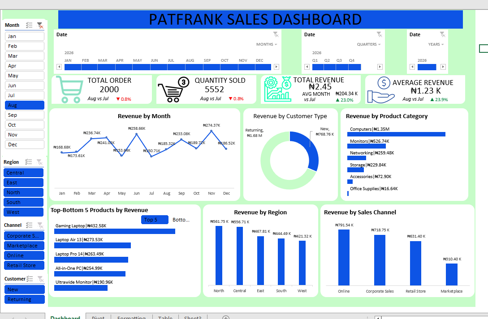

# pathfrank-sales-analytic-dasboard
Interactive Excel Sales Dashboard for analyzing revenue, orders, products, customers, regions, and sales channels, with actionable business insights and recommendations.

# Project Overview

I built this **Sales Performance Dashboard in Microsoft Excel** to analyze sales data and turn raw transaction records into clear business insights.

The dashboard allows users to monitor revenue, orders, quantity sold, customer types, product performance, regions, and sales channels. I also added interactive filters so users can explore the data by **month, region, channel, customer type, quarter, and year.**

The goal of this project was to answer important business questions and help management understand **what is driving sales and where there are opportunities for improvement.**

## 📊 Dashboard Preview
<a href ="https://github.com/Alrypto/pathfrank-sales-analytic-dasboard/blob/main/Screenshot%20sales.png">

  

